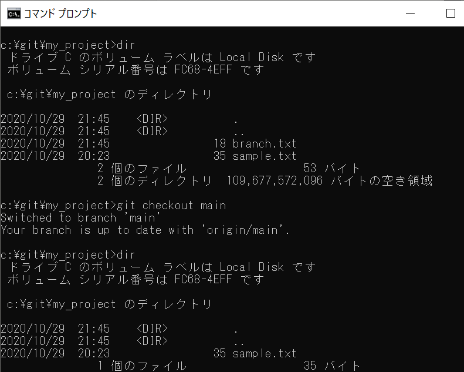
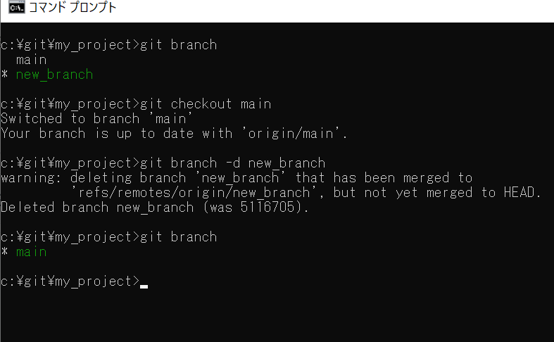

# ブランチを利用しよう

## ブランチとは？
mainブランチ以外の場所で別の修正を行うための、自分用の更新スペースです。

[Git - ブランチとは](https://git-scm.com/book/ja/v2/Git-%E3%81%AE%E3%83%96%E3%83%A9%E3%83%B3%E3%83%81%E6%A9%9F%E8%83%BD-%E3%83%96%E3%83%A9%E3%83%B3%E3%83%81%E3%81%A8%E3%81%AF)


## ローカルで新しいブランチを作ろう

現状の確認

```
git branch
```

新しいブランチを作る

```
git checkout -b new_branch
```


## ファイルを追加してみよう

```
echo "Hello, Branch" > branch.txt
git add branch.txt
git commit -m "Added new file"
```

mainブランチに戻ろう

```
git checkout main
```

ファイルの一覧を見てみよう




## GitHubにpushしよう

```
git checkout new_branch
git push --set-upstream origin new_branch
```


ブランチが増えていることを確認しよう


new_branchを確認しよう


## やってみよう
- 新しいブランチを作ろう
- ローカルでファイルを追加して、新しいブランチにpushしよう

## マージする

PR作ろう


タイトルと詳細を書く


mainブランチとの違いが判る


マージしたブランチは消しましょう。


ローカルのブランチは消えないので、コマンドで自分で消しましょう
邪魔じゃないなら別に消さなくてもいいです

```
git branch -d new_branch
```

