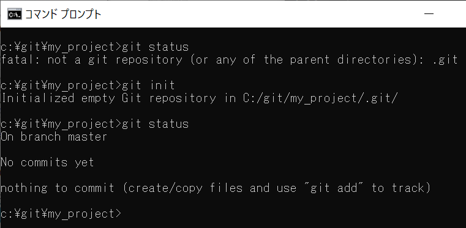
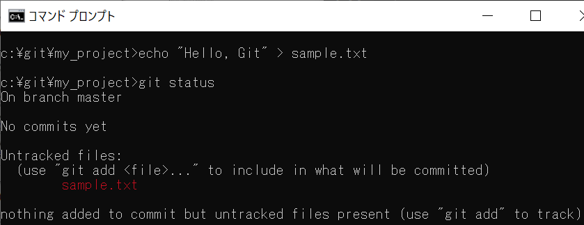
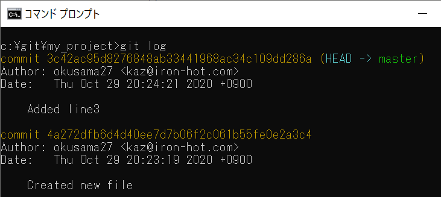

# ローカルでGitを使おう

## 目的
ファイルのバージョンを管理する

## 準備
### ローカルリポジトリを作成

詳細は以下を読もう

[Git - Git リポジトリの取得](https://git-scm.com/book/ja/v2/Git-%E3%81%AE%E5%9F%BA%E6%9C%AC-Git-%E3%83%AA%E3%83%9D%E3%82%B8%E3%83%88%E3%83%AA%E3%81%AE%E5%8F%96%E5%BE%97)

gitが使えるか確認しよう

```
git --version  # git使えるか確認
```

練習するディレクトリーを作ろう（ディレクトリー名はなんでもいいです。）
*gitから始まっているコマンドだけがgitのコマンドです。* 他のはwindowsとか、linuxとかのコマンドです。

```
mkdir my_project  # リポジトリ用のディレクトリーを作る
cd my_project  # 作ったディレクトリーに移動
```

リポジトリの初期化

```
git status  # 現在の状況を確認
git init  # リポジトリを作る
git status  # 現在の状況を確認
```

どうなっているか確認
（以下でディレクトリー内のファイルの一覧が見えるので気になった時に使ってください）

```
(win) dir /a
(mac) ls -la
```




## ハンズオン
### 新しいファイルを作ろう

詳しくは、以下を読もう

[Git - 変更内容のリポジトリへの記録](https://git-scm.com/book/ja/v2/Git-%E3%81%AE%E5%9F%BA%E6%9C%AC-%E5%A4%89%E6%9B%B4%E5%86%85%E5%AE%B9%E3%81%AE%E3%83%AA%E3%83%9D%E3%82%B8%E3%83%88%E3%83%AA%E3%81%B8%E3%81%AE%E8%A8%98%E9%8C%B2)


```
echo "Hello, Git" > sample.txt
```

リポジトリの状況を確認
（今後、コマンドを打つごとに状況を確認しましょう）

```
git status
```



ステージングに登録

```
git add sample.txt
```

ファイルの修正

```
echo "Line2" >> sample.txt
```

ステージングのファイルとの比較

```
git diff sample.txt
```

変更も登録

```
git add sample.txt
```

変更をコミット

```
git commit sample.txt -m "Created new file"
```

### やってみよう
- 現在のリポジトリの状態を確認しましょう
- ファイルsample.txtに3行目「Line3」を追加し、コミットしましょう

### 履歴を見よう

[Git - コミット履歴の閲覧](https://git-scm.com/book/ja/v2/Git-%E3%81%AE%E5%9F%BA%E6%9C%AC-%E3%82%B3%E3%83%9F%E3%83%83%E3%83%88%E5%B1%A5%E6%AD%B4%E3%81%AE%E9%96%B2%E8%A6%A7)

```
git log
```



### 作業のやり直し

[Git - 作業のやり直し](https://git-scm.com/book/ja/v2/Git-%E3%81%AE%E5%9F%BA%E6%9C%AC-%E4%BD%9C%E6%A5%AD%E3%81%AE%E3%82%84%E3%82%8A%E7%9B%B4%E3%81%97)

途中に戻る

```
git reset <commit id>
```

### やってみよう
- 新しいファイルを追加して、commit しましょう。（ファイルの追加はエクスプローラーから行ってもかまいません）
- 新しいファイルを修正して、commit しましょう。（ファイルの修正はメモ帳で行ってもかまいません）

### ファイルを無視したい
仮想環境用のファイル、開発ツール固有のファイル、キャッシュファイルなどはリポジトリに追加したくない。

#### 個人的に追加したくない
`.git/info/exclude` に対象外にしたいファイルを書く。

以下の例だと、 `test` からはじまるファイルと `.log` で終わるファイルは無視します。
```
# git ls-files --others --exclude-from=.git/info/exclude
# Lines that start with '#' are comments.
# For a project mostly in C, the following would be a good set of
# exclude patterns (uncomment them if you want to use them):
# *.[oa]
# *~
test*
*.log
```

無視されるか確認してみましょう

```
echo "Test" > test_1031.txt
echo "LogLogLog" > sample.log
git tatus
```

#### チーム全体で無視したい
`.gitignore` ファイルをリポジトリー直下に作成する
書き方はexcludeファイルと同じ
