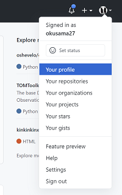
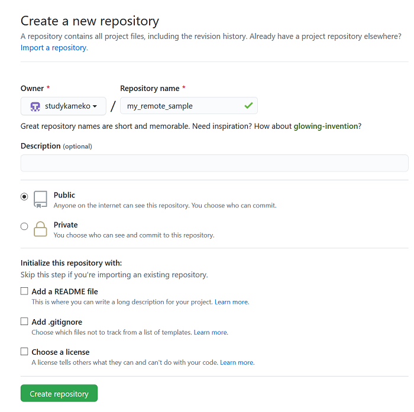
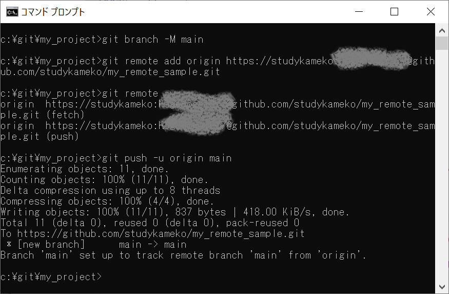

# GitHubを利用しよう

GitHubはインターネット上でGitの機能を使えるクラウドサービスです。
現在はMicrosoft社が管理運営しています。
GitHubを利用すると世界中の人と共同で開発を行えます。

## リポジトリを作る
GitHubにログインして自分のプロフィールページに移動します。



リモート側の作業領域（リポジトリー）をGitHub側に作ります。


*Repository name* に好きなリポジトリー名をつけてください。
リポジトリー名は後で変更できるのでそんなに悩まなくていいです。

Publicを選ぶと全世界の人に公開されるリポジトリーになります。
Privateを選ぶとあなたが許可した人にしか公開されないリポジトリーになります。

選択が終わったら、*Create repository* ボタンをクリックします。



リポジトリーが作成されたら、ローカルの作業領域（ローカルリポジトリー）と連動するやり方が表示されます。


書いてある通りにやります。パスワードを利用しているので、GitHubのユーザー名とパスワードを間に挟みます。

```
git branch -M main  # ローカルのブランチ名がmasterの人はmainに改名します。元のブランチ名がmainの人は不要です
git remote add origin https://<githubのユーザー名>:<githubのパスワード>@github.com/<user名>/<リポジトリ名>.git
git push -u origin main
```




## やってみよう

ローカルでファイルを追加し、GitHubのリポジトリにpushしましょう。
2回目からは `git push` だけでpushできます。
